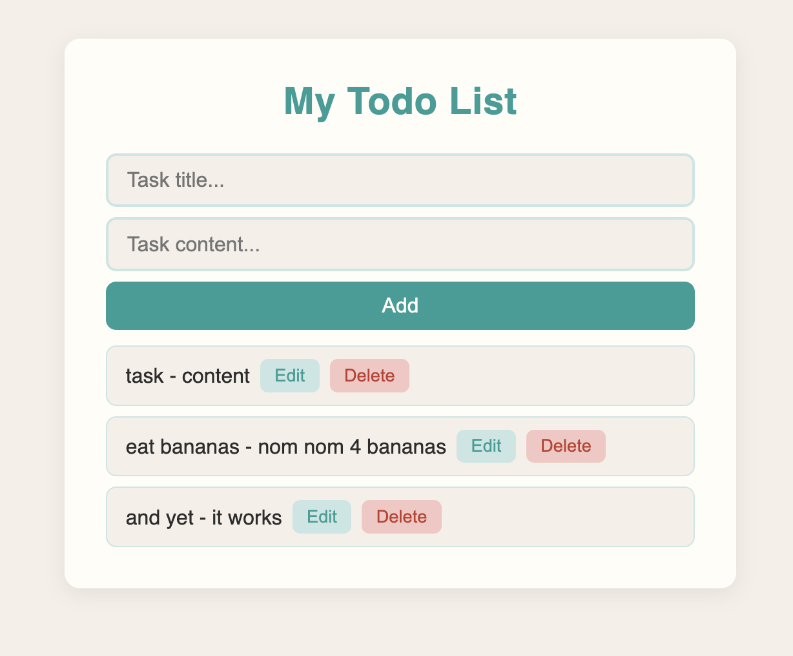

# Portfolio Project

This is a deployed version of my ToDoList project, as a submission to the challenge Week 7 of the skills Bootcamp in Full Stack Web Development, organized by Step8Up Ltd.

## Overview

### Screenshot

### Link

- Repository: [https://github.com/acmainier/deployed-todo-list](https://github.com/acmainier/deployed-todo-list)
- Render deployed webpage: [https://deployed-todo-list.onrender.com/](https://deployed-todo-list.onrender.com/)

## Built with

- Semantic HTML5 markup
- CSS3
- JavaScript (Fetch API)
- [Node.js](https://nodejs.org/)
- [Express](https://expressjs.com/)
- [uuid](https://www.npmjs.com/package/uuid) for generating unique note IDs
- RESTful API design (GET/POST/PUT/DELETE)
- JSON file-based persistence
- [Render](https://render.com/) for deployment

## Author

- Github - [Anne-Cécile Mainier](https://github.com/acmainier)
